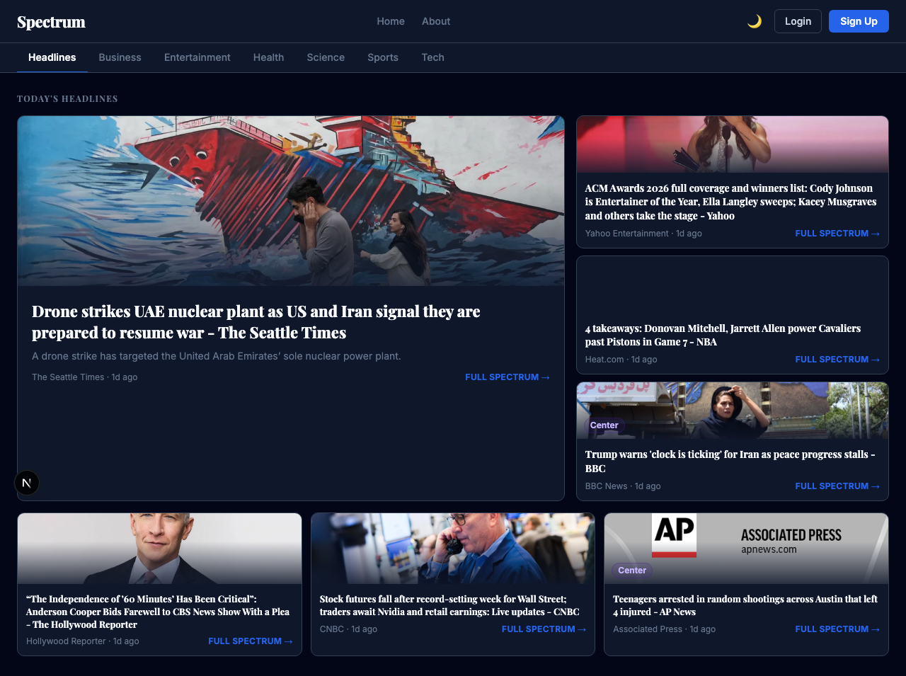
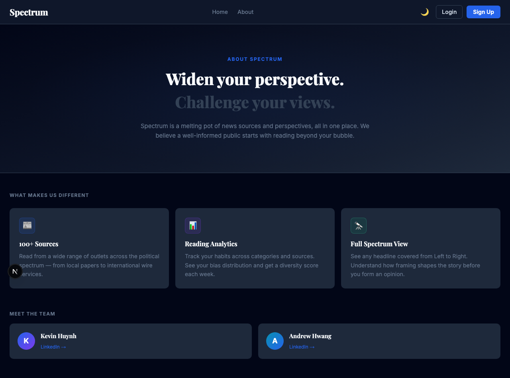
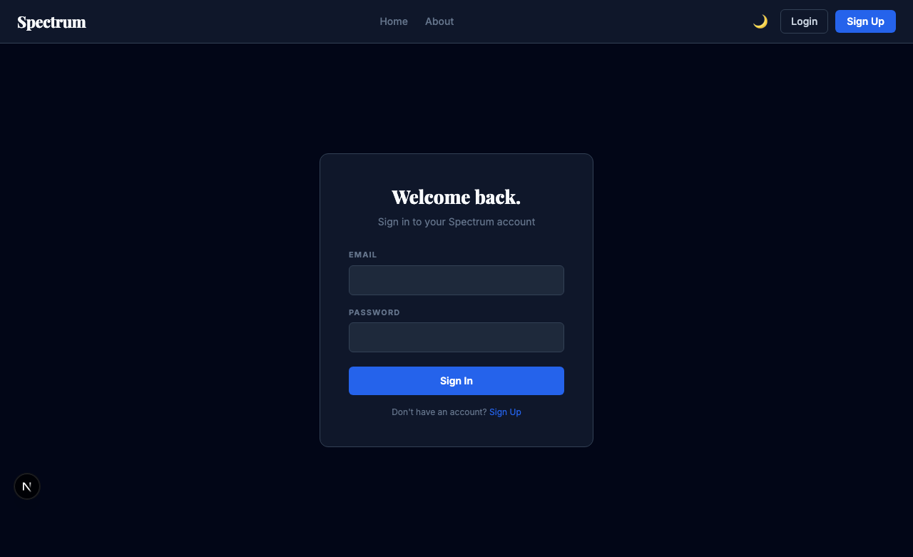
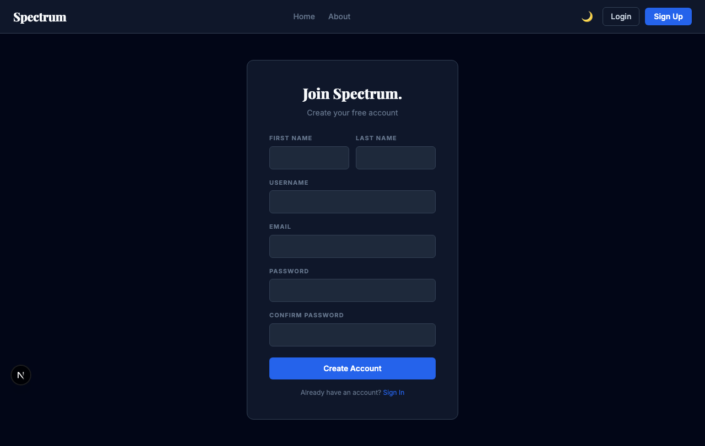

# Spectrum

> A news aggregator that surfaces political bias so you can read across the spectrum.

| | |
|---|---|
|  |  |
|  |  |


## Features

- **Bias detection** — every article tagged with a political lean via a curated ratings dataset
- **Full Spectrum view** — Left vs Right sourcing on the same headline, side by side
- **Category tabs** — filter by Headlines, Business, Entertainment, Health, Science, Sports, Tech
- **User dashboard** — reading stats, bias distribution overview, diversity score
- **Dark/light theme** — manual dark/light toggle
- **Auth** — sign up / sign in with NextAuth v5 (beta)

## Getting Started

### Prerequisites

- Node.js 20+
- pnpm: `npm install -g pnpm`

### Install

```bash
git clone https://github.com/<your-org>/spectrum-next.git
cd spectrum-next
pnpm run bootstrap
```

### Environment variables

Create a `.env.local` file in the project root:

| Variable          | Description                               |
|-------------------|-------------------------------------------|
| `NEWSAPI_KEY`     | API key from [newsapi.org](https://newsapi.org) |
| `NEXTAUTH_SECRET` | Random secret — generate with `openssl rand -base64 32` |
| `NEXTAUTH_URL`    | Base URL of the app, e.g. `http://localhost:3000` |
| `OPENAI_API_KEY`  | OpenAI API key — used for article bias scoring |
| `DATABASE_URL`    | Path to SQLite DB (optional — defaults to `spectrum.db` in project root) |

### Run

```bash
pnpm dev      # Start dev server at http://localhost:3000
pnpm test     # Run Vitest test suite
pnpm lint     # ESLint (Prettier runs automatically on commit via Husky)
pnpm build    # Production build
```

## Architecture

### Routes

| Route                     | Description                              |
|---------------------------|------------------------------------------|
| `/`                       | News feed with category tabs             |
| `/fullspectrum/[title]`   | Left vs Right comparison for a headline  |
| `/user`                   | Personal dashboard & reading stats       |
| `/about`                  | About page                               |
| `/login`                  | Sign in                                  |
| `/signup`                 | Create account                           |

### tRPC Routers (`src/server/routers/`)

| Router    | Responsibilities                          |
|-----------|-------------------------------------------|
| `news`    | Fetch & cache articles from NewsAPI       |
| `auth`    | User registration, login, session         |
| `metrics` | Reading history, bias scores, diversity   |

### Key directories

```
src/
├── app/          # Next.js App Router pages
├── components/   # Shared UI (Navbar, NewsCard, BiasChip, CategoryTabs)
├── server/       # tRPC routers + Drizzle schema
├── lib/          # bias.ts, newsapi.ts, db.ts
└── trpc/         # tRPC client setup
```
